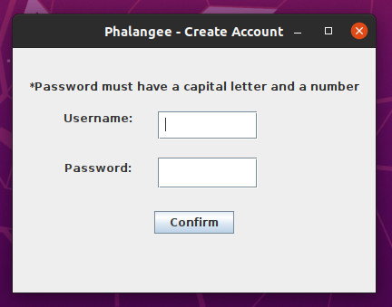
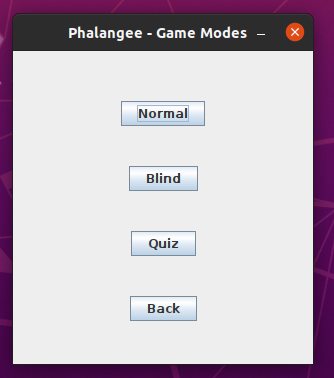
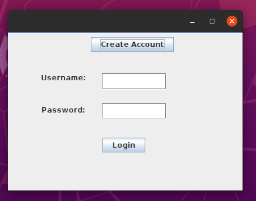
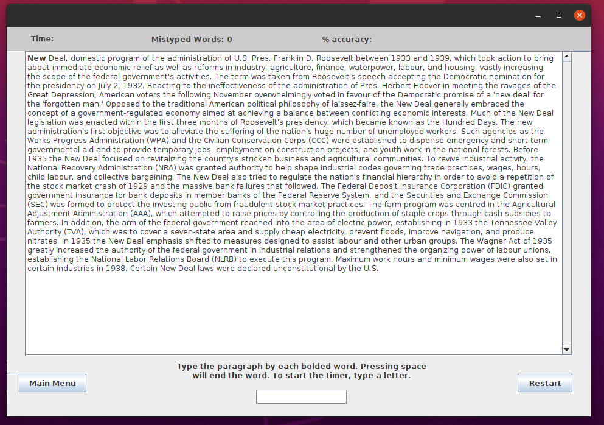

# Phalangee
A basic typing test program that allows users to see how fast they type. It is still a work in progress. The user has a typing field towards the bottom of the page where they can type words in. The number below
that is the number of seconds since the user started typing if they have already done so. The user must type each bolded word that they see in the paragraph above. Pressing the 
spacebar will advance the bolded word to be the next word in the paragraph. Once one minute has passed, the user will be able to see their words per minute (abbreviated as WPM). 

<h1> Plans for the application </h1>
This is a work in progress, so I plan to:
<ul>
  <li> Make the GUI more visually appealing </li>
  <li> Create a database that allows users to store their score data </li>
  <li> Implement a graph that shows how the user has performed over time </li>
  <li> More paragraphs for the user to type off of </li>
</ul>
